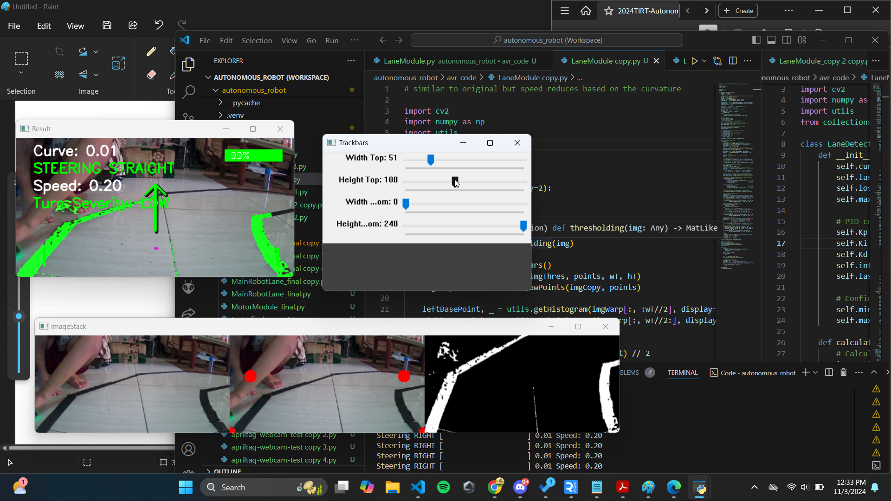

This is a Raspberry Pi-powered autonomous vehicle robot that follows lanes and responds to AprilTags for dynamic commands. The robot is designed for high-performance tasks, leveraging dual cameras for advanced functionality and multiple motors for smooth navigation.

Features
Lane Following:
A camera detects lane markings and adjusts the robot's movement to stay within the lane.

AprilTag Detection:
A second camera scans for AprilTags and triggers actions like:

Stop: Halts the robot upon detecting a specific tag.
Slow Down: Reduces speed based on the tag ID.
Dual Power Source:
Powered by two independent battery packs to ensure optimal performance for motors and processing.

Hardware Components
Raspberry Pi 4
Central processing unit for the robot.

Motors:
Four motors for enhanced maneuverability and power.

Cameras:
Two cameras:

One for lane detection.
One for AprilTag recognition.
Motor Driver:
Cytron motor driver for efficient motor control.

Battery Packs:
Two battery packs, each holding four 18650 batteries, provide ample power for prolonged operation.

Software
Python: Primary programming language.
OpenCV: For image processing tasks like lane detection and AprilTag recognition.
AprilTag Library: For decoding and responding to AprilTags.
How It Works
Lane Following:

The lane detection camera captures real-time video feed.
Image processing identifies lane markings and guides the robot along the path.
AprilTag Detection:

The second camera scans for AprilTags along the route.
Upon detecting a tag, the system decodes its ID and executes the corresponding action.

